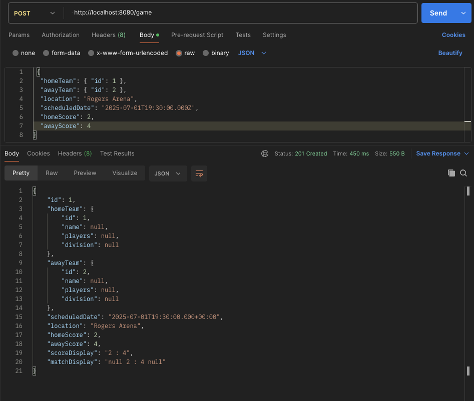
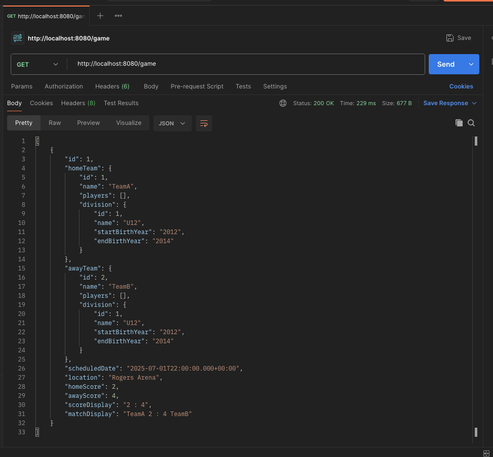

# Adding Games Branch to Hockey Registration REST API

This repo builds on an existing one (https://github.com/jamie-keyin/s4_2024_hockey_reg_system_api) to add support for managing **hockey games** as part of the larger system, which already includes features for managing **teams**, **players**, and **divisions**.

## Overview

The `games` module allows the creation, retrieval, updating, and deletion of scheduled or completed hockey games. Each game records:

- Home and away teams (`Team`)
- Date and time (`Calendar`)
- Location (`String`)
- Scores (nullable `Integer`)

Games are exposed via REST endpoints and support queries by team name or location.

---

## Features

### Endpoints

| Method | Endpoint              | Description                               |
|--------|------------------------|-------------------------------------------|
| GET    | `/game`               | Returns all games                         |
| GET    | `/game/{id}`          | Returns a game by ID                      |
| GET    | `/game/search`        | Filter games by team name and/or location |
| POST   | `/game`               | Create a new game                         |
| PUT    | `/game/{id}`          | Update an existing game                   |
| DELETE | `/game/{id}`          | Delete a game by ID                       |

**Query Examples:**

- `/game/search?team_name=Sharks`
- `/game/search?location=Rink A`
- `/game/search?team_name=Sharks&location=Rink A`

---

## Integration with Other Entities

This branch assumes the following relationships:

- A `Game` references two `Team` objects: `homeTeam` and `awayTeam`.
- `Team` objects are part of a `Division`.
- `Team` objects also link to `Player` entries (handled in the `player` module).

The system should be seeded with teams, players, and divisions first — as games depend on those entities being present.

---

## Development and Testing

- This branch supports API testing with **Postman** or other tools (see images below).
- Sample data can be posted to `/game` as JSON.

  

  

---

## Notes

- Uses `@ManyToOne` JPA mappings to link `Game` to `Team`
- Scores are `Integer` so they can be `null` until the game is completed
- Custom `getMatchDisplay()` and `getScoreDisplay()` methods give easy-to-read summaries
